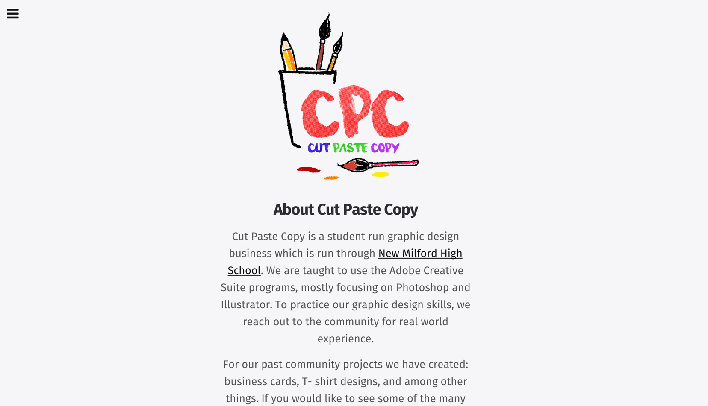

# Cut, Paste & Copy [Website]



## About Cut, Paste & Copy
Cut, Paste & Copy is a student run graphic design business. We use several of the Adobe Creative Suite programs, such as, Photoshop, Illustrator, and inDesign. To practice our graphic design skills, we reach out to the community for real world experience. For our past community projects we have created business cards, t- shirt designs, posters, booklets, and more.

# About the Project
CodeKit Starter Kit is a simple, responsive boilerplate to kickstart any responsive project.
It is built on [Skeleton](https://github.com/dhg/Skeleton), to provide a simplistic start to any web development project. This kit is built to be used in conjunction with [CodeKit](https://incident57.com/codekit/) to compile jade, js, scss, sass, etc files into their respective file-types.

## Requirements
In the attempt to make this project as simple as possible, this project has only one requirement, as noted below:

~ Must have [CodeKit](https://incident57.com/codekit/) installed on your macintosh computer.

## Install
In order to start using this project, you need to:

1. Clone/download this repository to your machine.
2. Install [CodeKit](https://incident57.com/codekit/) onto your macintosh computer.

## Structure
The project has a very simple and flexible structure.

```
├───assets/ -> All the compiled and minified css and javascript is located here.
│   ├───css/ -> Compiled CSS directory
│   │   └───index.css -> Main Compiled SCSS file
│   ├───images/ -> Images directory
│   ├───js/ -> Compiled Javascript directory
│   │   └───functions-min.js -> Main Compiled Javascript file
├───js/ -> Un-Compiled Javascript directory
│   ├───functions.js -> Un-Compiled Javascript file
├───scss/ -> Un-Compiled SCSS directory
│   ├───partials/ -> Tools/Frameworks
│   ├───index.scss -> Un-Compiled SCSS file
├───views/ -> Un-Compiled Jade directory
│   ├───includes/ -> Un-Compiled Jade files to be included inside the `index.jade` file
├───settings/ -> Starter Kit Settings
│   ├───index.jade -> Un-Compiled Jade file
├───index.html -> Main Compiled Jade file
├───favicon.ico
```
